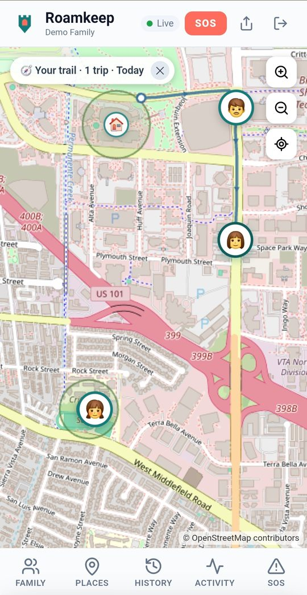
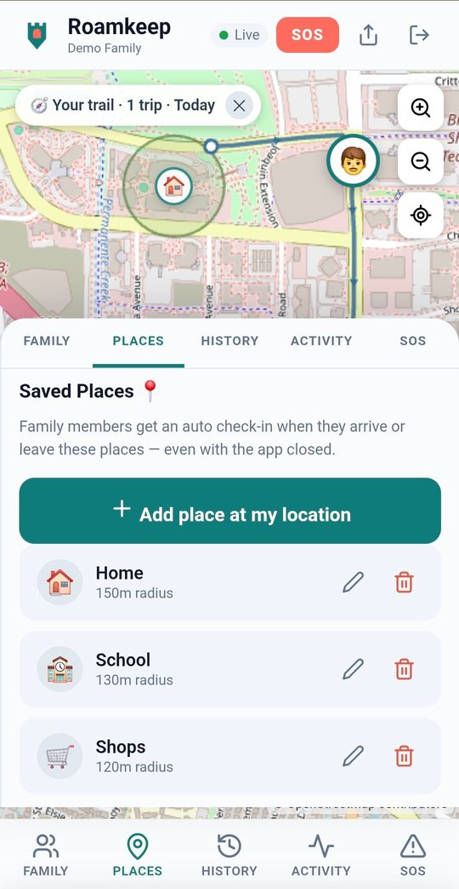
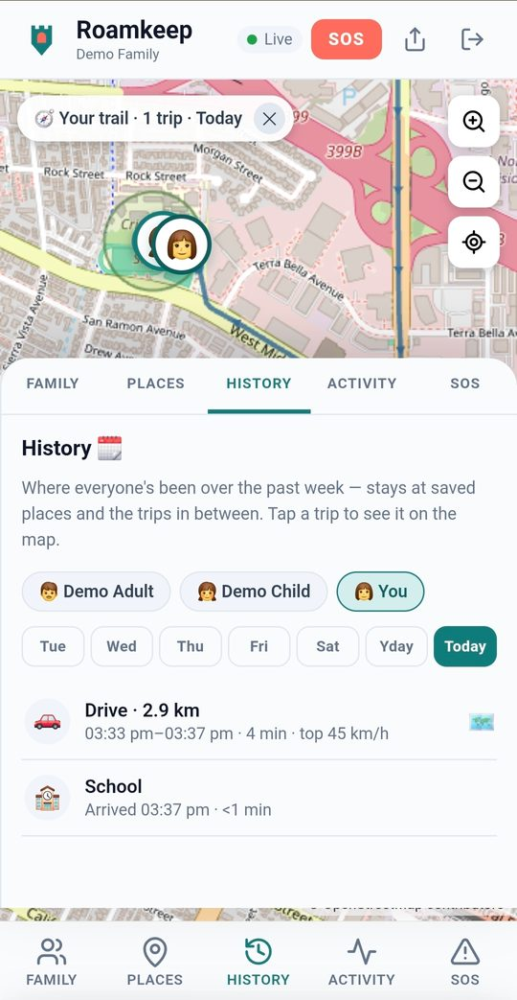

# Roamkeep

A private family location-sharing app: a vanilla-JS PWA, wrapped in a
Capacitor Android shell, backed by Supabase, with native OS geofencing and
content-free push notifications.

Every family runs their **own** backend. The app is pointed at a family's own
Supabase project at first run, and the author operates no server that holds a
family's data — the one author-run component, a push relay, sees only opaque
device tokens and timing, never names, places, or coordinates. The source is
published so those claims can be checked.

## Screenshots

<!--
  Plain phone captures, downscaled to 540px — deliberately NOT the
  letterboxed 9:16 variants that `node tools/store-assets.js` writes into
  the gitignored store/ dir for Play.

  Every one is from the demo backend: invented people, invented places,
  synthetic trails. No real family appears in this repository.
-->

| Map & live pins | Places & geofences | History timeline |
|---|---|---|
|  |  |  |

## Run it for your family

Install **Roamkeep** from Google Play, then give it a backend to talk to. You
never build the app; you provision a database and point the app at it.

```bash
cd cli && npm start
```

The wizard creates a Supabase project, applies the schema, wires the
check-in webhook, and prints a setup link and QR code. Scan it with the app
and the first device to connect becomes the owner of your Keep; everyone
else joins from an invite shared inside the app.

The long version, including the Windows-specific traps, is in
**[docs/OWNER_SETUP.md](docs/OWNER_SETUP.md)**.

## How it works

The same web bundle runs two ways: as a PWA served straight off S3, and
wrapped in a Capacitor Android shell that adds OS-level geofencing, a
background-location foreground service, and push. Supabase is the shared
backend — Postgres, row-level security, realtime, auth, one Edge Function.
There is no custom server.

**[docs/ARCHITECTURE.md](docs/ARCHITECTURE.md)** is the long version,
including the parts that are non-obvious: why push is content-free, how
native geofence state is kept in step with the database, and which failures
are silent by nature.

## Contributing

Small and specific is best. [CONTRIBUTING.md](CONTRIBUTING.md) covers the
conventions and the contributor terms — the latter exist so that every
version can still convert to Apache 2.0 on its Change Date.

## Security

Please report vulnerabilities privately — see
**[SECURITY.md](SECURITY.md)**, which also lists the things that look like
vulnerabilities and are not (the anon key is public by design; row-level
security is the boundary).

## License — source-available, not open source

Roamkeep is released under the **Business Source License 1.1 (BSL 1.1)**. See
[`LICENSE`](LICENSE) for the full text and parameters.

**BSL is not an OSI "open source" license, and we don't call it one.** It is
*source-available*: the complete source is public and auditable, but some
commercial rights are reserved for a time. We chose it deliberately, and the
distinction matters, so here is the reasoning in full.

- **The privacy claims are the product, and they are only credible if you can
  read the code.** Roamkeep's whole premise is that each family holds their own
  data and the author can't see it. A closed binary asking you to trust that is
  not good enough. Publishing the source lets anyone verify what the app sends,
  where it sends it, and what the relay does and doesn't retain.

- **Source-available gets us that auditability without giving away the right to
  compete commercially.** Under the BSL you may read, modify, build, and
  self-host Roamkeep for your **own family's personal, non-commercial use** —
  that's the [Additional Use Grant](LICENSE), and it's granted freely. What the
  license withholds is the right to take this code and offer it to third parties
  as a paid or competing hosted service. That reservation is why this is BSL and
  not AGPL: the goal here is to protect that specific commercial position while
  keeping everything else open, rather than to maximize openness for its own
  sake.

- **It doesn't stay restricted forever.** The BSL has a built-in expiry. Each
  released version carries a **Change Date** — four years after that version is
  first published — on which it automatically converts to the **Apache License
  2.0**, a permissive open-source license. So every version becomes fully open
  source on a rolling schedule; the restriction is a head start, not a
  permanent enclosure.

- **The word choice is deliberate.** "Open source" has a specific meaning (the
  OSI definition) that the BSL does not meet, and misusing the term invites an
  argument that adds nothing. We say **source-available**. If that distinction
  matters to you, it should — and now you know exactly where Roamkeep sits.

The author retains copyright, so separate commercial licensing terms are
available on request — see the contact in [`LICENSE`](LICENSE).

## Support development

Roamkeep is free, has no paid features, and runs no author-operated tier — the
model is deliberately **self-host plus donations**. If it's useful to your
family and you'd like to help cover the cost of the one shared piece (the push
relay) and continued development, you can chip in:

- **GitHub Sponsors** — https://github.com/sponsors/roamkeep
- **Ko-fi** — https://ko-fi.com/Roamkeep

Donations support development only; they don't unlock features (there aren't
any to unlock) and confer no commercial license — see the section above for
that.
